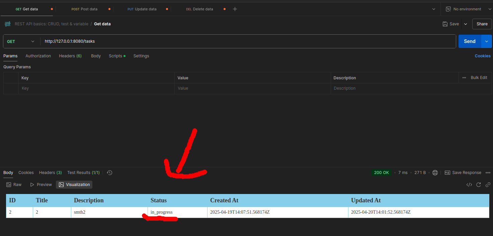
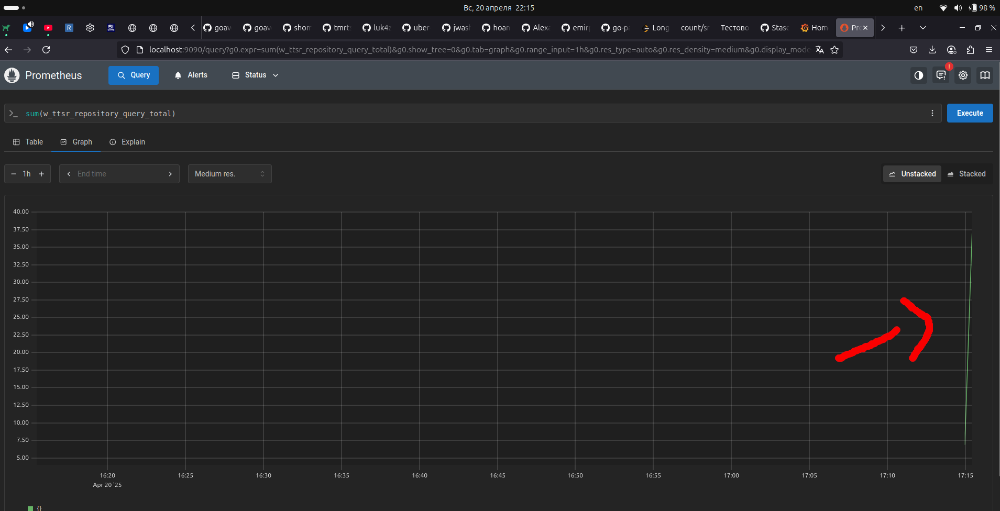

# w_ttsr

Тестовое задание. `REST API` для управления задачами (TODO-лист).

- [описание задания](#описание-задания)
- [структура проекта](#структура-проекта)
- [способ использования; скриншоты](#способ-использования-скриншоты)
- [документация](#документация)
- [метрики](#метрики)

---

## описание задания

Возможные действия:
- Создание задач (`POST` запрос)
- Чтение списка задач (`GET` запрос)
- Обновление задачи (`PUT` запрос)
- Удаление задачи (`DELETE` запрос)

<br>

Реализовано с помощью:
- Go + Fiber
- PostgreSQL (через `pgx`)
- Docker + docker-compose

<br>

Задача состоит из:
- Идентификатора (`id`)
- Заголовка (`title`)
- Описания (`description`)
- Статуса (`status`) - `new`, `in_progress`, `done`
- Времени создания (`created_at`)
- Времени обновления (`updated_at`)

<br>

API-эндпоинты:
- `POST` `/tasks` - создание задач
- `GET` `/tasks` - получение списка всех задач
- `PUT` `/tasks/:id` - обновление задачи
- `DELETE` `tasks/:id` - удаление задачи

---

## структура проекта

- cmd/server/main.go - точка входа программы
- config/config.yaml - конфигурационный файл с настройками сервера
- db/init/tasks.sql - sql-скрипт для инициализации БД
- img - скриншоты работы программы
- [internal](internal/README.md) - отдельные компоненты программы (контроллер, репозиторий  и пр.)
- .env - файл с переменными окружения для запуска через `docker`
- docker-compose - файл для управления контейнерами СУБД и самой программы
- Dockerfile - настройка контейнера для программы
- go.mod и go.sum - зависимости
- Makefile - удобный запуск через `make`
- prometheus.yml - настройки `prometheus`

---

## запуск

Основное:
```bash
git clone https://github.com/Stasenko-Konstantin/w_ttsr && cd w_ttsr
make init  # первый запуск, инициализация postgres
```

Дополнительные удобства:
```bash
make stop  # выключение сервера
make run   # запуск уже инициализированного сервера, есть доступ к постоянным данным
make clear # полный сброс с уничтожением данных
```

---

## способ использования; скриншоты

На примере `Postman`.

Создание задачи (`POST`):


Проверяем через `GET`:


Обновление задачи (`PUT`):


Проверяем через `GET`:


Удаление задачи (`DELETE`):


Проверяем через `GET`:


---

Наличие записей в БД:


---

## документация

Сперва нужно запустить локальный сервер для документации:
```bash
make doc
```

Затем можно смотреть саму документацию:
- [config](http://localhost:6060/pkg/github.com/Stasenko-Konstantin/w_ttsr/internal/config/)
- [controller](http://localhost:6060/pkg/github.com/Stasenko-Konstantin/w_ttsr/internal/controller/)
- [domain](http://localhost:6060/pkg/github.com/Stasenko-Konstantin/w_ttsr/internal/domain/)
- [repository](http://localhost:6060/pkg/github.com/Stasenko-Konstantin/w_ttsr/internal/repository/)
- [server](http://localhost:6060/pkg/github.com/Stasenko-Konstantin/w_ttsr/internal/server/)

---

## метрики

Также ради интереса реализовал простые метрики (открывать ссылки после [запуска](#запуск)):

- [grafana](http://localhost:3000/) - в качестве источника данных использовать `prometheus` по ссылке `https://prometheus:9090`
- [prometheus](http://localhost:9090/) - `sum(w_ttsr_repository_query_total)`

`grafana`:


`prometheus`:
